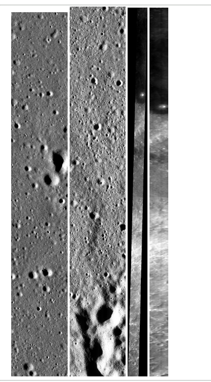
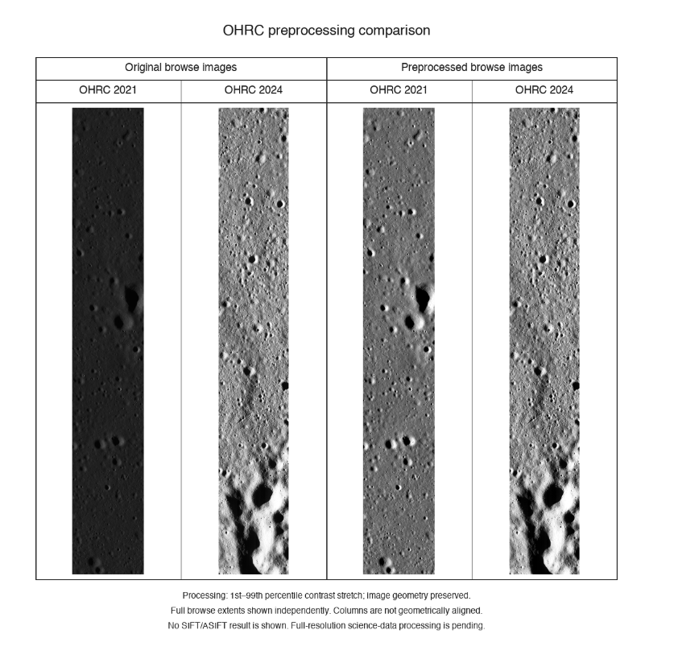
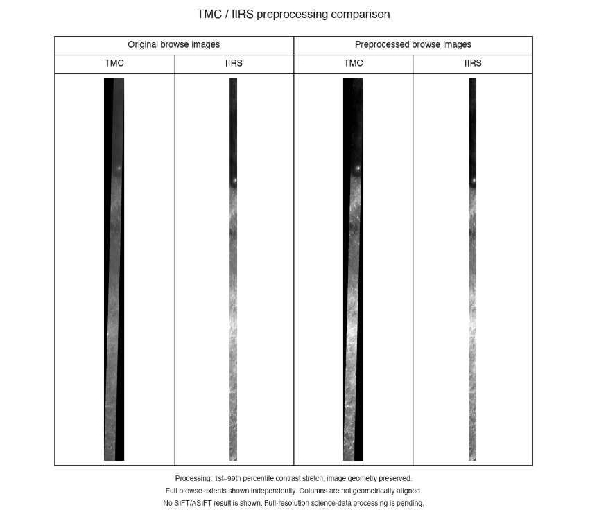
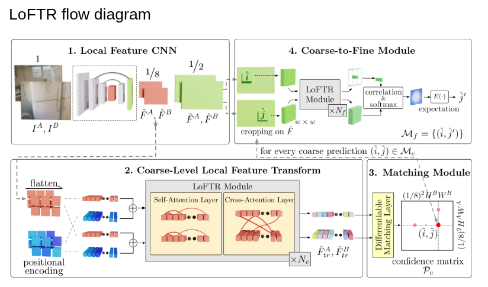
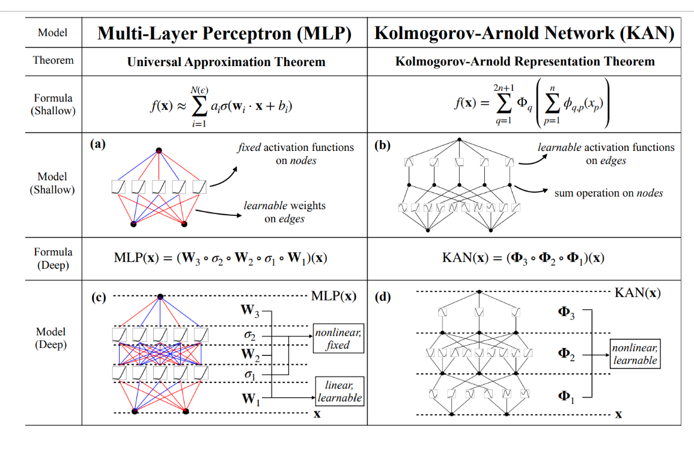
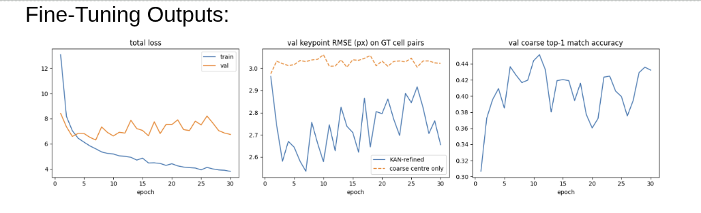
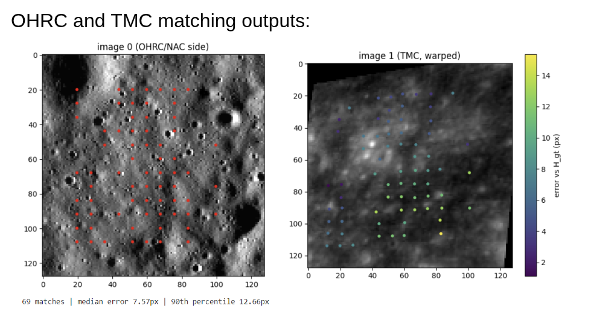

# Cross-Sensor Lunar Image Registration Using Chandrayaan-2 Data and KAN-Enhanced LoFTR

## Overview

Aligning lunar images acquired by different sensors is a fundamental challenge in planetary science and lunar exploration. Images captured by sensors such as the Chandrayaan-2 Optical High Resolution Camera (OHRC), Terrain Mapping Camera-2 (TMC-2), Imaging Infrared Spectrometer (IIRS), and the Lunar Reconnaissance Orbiter Narrow Angle Camera (LRO NAC) often differ significantly in spatial resolution, viewing geometry, illumination conditions, surface shadows, intensity profiles, and overall appearance. 

The primary purpose of this project is to produce reliable, geometrically consistent correspondences and spatial alignments between multi-sensor images of the same lunar terrain. To achieve this, the project combines structured data preparation, transformer-based dense feature matching, Kolmogorov-Arnold Network (KAN) model modifications for final prediction refinement, confidence-based filtering, and quantitative evaluation. This pipeline addresses the complexities of cross-sensor lunar image registration while maintaining structural fidelity.

## Project Objectives

- Preparing Chandrayaan-2 and reference lunar imagery through a structured data preprocessing pipeline.
- Creating suitable cross-sensor image pairs representing overlapping lunar terrain.
- Training and fine-tuning a deep image-matching model adapted to lunar surface characteristics.
- Improving the final matching and prediction stage using a Kolmogorov-Arnold Network (KAN).
- Measuring match quality and geometric consistency using repository-supported evaluation measures.
- Presenting the workflow, preprocessing stages, and visual results through the project demonstration website.

## Dataset and Sensors

The project integrates multi-sensor datasets derived from Indian Space Research Organisation (ISRO) Chandrayaan-2 missions alongside NASA Lunar Reconnaissance Orbiter (LRO) data. Each data source serves a specific functional role:

### Chandrayaan-2 OHRC
The Optical High Resolution Camera (OHRC) provides high-spatial-resolution lunar surface imagery, serving as detailed local terrain data within the registration workflow.

### Chandrayaan-2 TMC-2
The Terrain Mapping Camera-2 (TMC-2) provides stereo and monoscopic mapping imagery with distinct swath characteristics and spatial properties compared to OHRC.

### Chandrayaan-2 IIRS
The Imaging Infrared Spectrometer (IIRS) contributes spectral and infrared-related lunar information, enriching the multi-sensor registration and analysis environment.

### LRO NAC
The Lunar Reconnaissance Orbiter Narrow Angle Camera (LRO NAC) imagery is utilized as high-resolution reference data for comparative evaluation and spatial registration anchoring.

*Note: Exact spatial resolutions and acquisition statistics are not specified in the repository.*



## Data Preprocessing

The data preprocessing workflow prepares raw scientific datasets for deep feature matching. Based on the repository and website implementation, the pipeline covers the following stages:

1. Inspecting and validating source imagery.
2. Reading scientific image formats such as PDS IMG, TIFF, or other repository-supported formats.
3. Converting suitable inputs into processing-friendly image formats.
4. Removing invalid borders, padding, or non-image regions using validity masks.
5. Resampling images to a common spatial resolution.
6. Projecting images onto a common lunar coordinate grid.
7. Normalizing image intensity profiles to mitigate illumination discrepancies.
8. Identifying overlapping geographic regions across sensors.
9. Creating spatially aligned image tiles.
10. Creating image pairs for training, validation, and evaluation.
11. Applying controlled transformations such as rotation or translation, where supported by the code or documentation.
12. Maintaining geographically separated regions where leakage prevention is indicated in the repository.

The processed outputs are organized across the following repository directories:
- `Preprocessed_Outputs/loftr`
- `Preprocessed_Outputs/nac`
- `Preprocessed_Outputs/overlap`
- `Preprocessed_Outputs/pairs`
- `Preprocessed_Outputs/registration`





## Image Pair Construction

Image pairs are foundational for cross-sensor registration, establishing direct links between moving images and reference images over shared terrain.

- **Moving and Reference Images:** Images from Chandrayaan-2 sensors act as moving inputs, while reference data (such as LRO NAC) provides the spatial baseline.
- **Common Terrain and Overlap:** Pairs are constructed to ensure representation of identical lunar surface features despite cross-sensor variations.
- **Pair Index and Storage:** The preprocessed pair data and index structures are stored under `Preprocessed_Outputs/pairs/`, including `Preprocessed_Outputs/pairs/index.json`, `Preprocessed_Outputs/pairs/pairs.npz`, and `Preprocessed_Outputs/pairs/preview.png`.
- **Role in Workflow:** Pair construction systematically organizes data to support model training, validation, and evaluation routines.

## Model Architecture

The model architecture integrates transformer-based dense feature matching with a Kolmogorov-Arnold Network (KAN) enhancement at the prediction stage.

### LoFTR and Transformer-Based Matching

LoFTR (Local Feature Transformer) is a detector-free image matching model that operates on dense features rather than isolated local keypoints. The transformer component plays a central role:
- Features from both input images interact via self-attention and cross-attention mechanisms.
- Self-attention enables each image to establish wider spatial context.
- Cross-attention allows direct comparison between the moving image and the reference image.
- This mechanism is well-suited for lunar imagery, where illumination, scale, contrast, and sensor responses vary.
- The coarse matching stage establishes broad candidate correspondences, while the fine matching stage refines spatial locations.

The repository retains a pretrained feature-extraction backbone while focusing fine-tuning on selected matching components supported by the implementation.



### KAN-Enhanced LoFTR

The project modifies the standard LoFTR architecture by integrating a Kolmogorov-Arnold Network (KAN):
- The final prediction or layer component of the LoFTR-based pipeline is replaced or augmented with a KAN.
- The transformer backbone retains responsibility for contextual feature interaction and cross-image correspondence reasoning.
- The KAN is positioned at the pipeline output stage to transform learned representations into final predictions or matching decisions.
- This targeted modification preserves useful feature extraction while introducing a flexible nonlinear mapping.

**Understanding KANs:**
- Conventional multilayer perceptrons (MLPs) rely on fixed linear weights followed by static activation functions.
- KANs utilize learnable one-dimensional functions (often parameterized via B-splines) along network connections.
- These adaptive functions model complex nonlinear relationships with high flexibility.
- In this project, the KAN refines the final prediction stage where correspondence decisions are sensitive to subtle local cross-sensor differences.

The relevant implementation files include:
- `Model/kan-loftr-code/kan.py`
- `Model/kan-loftr-code/model.py`
- `Model/kan-loftr-code/train.py`
- `Model/kan-loftr-code/evaluate.py`



## Training and Fine-Tuning

The training workflow is structured around modular Python scripts and a fine-tuning notebook:
- **Dataset Loading:** Implemented via `Model/kan-loftr-code/dataset.py`.
- **Model Construction:** Defined in `Model/kan-loftr-code/model.py`.
- **KAN Integration:** Implemented in `Model/kan-loftr-code/kan.py`.
- **Training Logic:** Managed through `Model/kan-loftr-code/train.py`.
- **Evaluation Logic:** Handled via `Model/kan-loftr-code/evaluate.py`.
- **Fine-Tuning Notebook:** Conducted interactively using `Model/kan-loftr-finetune.ipynb`.

**Motivation for Fine-Tuning:** Fine-tuning on lunar imagery adapts the model from general terrestrial feature distributions to specialized lunar surface textures, harsh lighting, shadows, and unique sensor characteristics.



## Matching, Filtering, and Evaluation

Post-processing and evaluation ensure that generated correspondences are geometrically sound and reliable. Repository-supported evaluation measures include:
- Match count.
- Inlier ratio.
- Ground-truth error.
- Corner-transfer error.
- Spatial match coverage.
- Root Mean Square Error (RMSE) or related error measures.
- Confidence-based filtering.
- Robust geometric transformation estimation.

**Necessity of Filtering:** Not all predicted correspondences are correct. Low-confidence or geometrically inconsistent matches can distort registration accuracy. Filtering removes unreliable points to improve measurement and visualization quality.



## Results and Observations

Observations derived from repository figures, website assets, and evaluation outputs indicate:
- Training loss decreases across the recorded training runs.
- KAN-refined results provide visual and spatial comparisons against baseline outputs.
- Matching outputs successfully demonstrate cross-sensor correspondences for OHRC, TMC, and reference image pairs.
- The project demonstrates measurable cross-sensor feature correspondences rather than purely qualitative visual alignment.

*Note: Displayed numerical results reflect specific experimental runs included in the repository and are not generalized performance guarantees.*

## Relation to the Referenced Research Paper

Background and motivation are drawn from the research paper:
[Comparative Evaluation of Traditional and Deep Learning Feature Matching Algorithms using Chandrayaan-2 Lunar Data](https://arxiv.org/abs/2509.04775)

**Paper Findings:** The referenced paper evaluates traditional and deep-learning feature matching techniques on Chandrayaan-2 data, highlighting the critical role of rigorous preprocessing, resolution alignment, intensity normalization, and learning-based matching under challenging lunar conditions.

**Project Uplift and Extension:**
- The research paper provides conceptual motivation for advanced preprocessing and learned feature matching.
- This project implements a dedicated OHRC, TMC-2, IIRS, and LRO NAC workflow.
- It investigates a transformer-based LoFTR architecture rather than conventional descriptors alone.
- It introduces a KAN-based modification at the final prediction stage to enhance nonlinear mapping.
- It provides an end-to-end repository structure including preprocessing pipelines, pair generation scripts, model implementations, evaluation routines, and a visual demonstration website.

## Repository Structure

```text
Model/
  kan-loftr-code/
  kan-loftr-finetune.ipynb

Preprocessed_Outputs/
  loftr/
  nac/
  overlap/
  pairs/
  registration/

Lunar_Site/
  index.html
  assets/

audit/
  dataset and metadata inspection files
```
