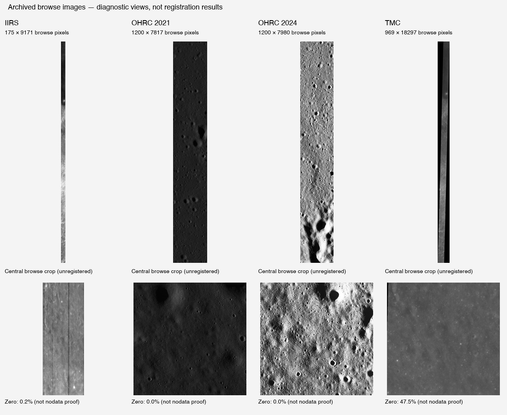

# SIH lunar registration dataset audit

**Status: metadata, geometry, code and archived-browse audit completed; full science-pixel audit pending.**

Repository: [ishitabarnwal37-cloud/SIH_Lunar_Model](https://github.com/ishitabarnwal37-cloud/SIH_Lunar_Model), `main`, inspected commit `7698d751dff37a8d72f6923484c409572078dbb4` (2026-09-19). Audit date: 2026-09-21.

**Provisional verdict: PARTIALLY READY.** There is useful terrain, a strong TMC–IIRS overlap candidate and an OHRC repeat-image candidate. However, all four repository science products have storage/label completeness problems, the proposed OHRC–TMC overlap is contradicted by browse support, and no authentic LRO/SELENE reference image or independent control-point set was found. The repository is **not ready for a defensible registration benchmark in its current stored state**. This verdict does not establish the condition of original files on the user's machine: their location has not yet been provided.

No original data, preprocessing or registration code was changed. No model was trained or framework installed. All new material is under `audit/`. The snapshot is a selected evidence copy, **not a usable dataset checkout**: `.img`/`.tif` copies there are LFS pointer text. `tmc_metadata_only_sparse.tif` is a diagnostic header reconstruction with holes, **not an image**.

Evidence terminology:

- **Read:** values from labels, native TIFF tags, fixed-width orbit/attitude records, geolocation grids, Git blobs/pointers or actual browse pixels.
- **Calculated:** reproducible quantities derived from that evidence, with assumptions stated.
- **Inferred:** suitability or expected method behavior; not an empirical registration result.
- **not available:** evidence needed for a measurement is absent or inaccessible.

## 1. Repository Summary

The recursive Git tree contains 71 files, including 22 Python files and four science-product directories. The current Codex workspace initially contained only an empty Git repository. A filename search under Documents, Downloads and Desktop found no separate matching science dataset; this is not a search of every disk or external drive.

```text
SIH_Lunar_Model/
├── README.md                         # only the repository title
├── .gitattributes                    # LFS patterns: img, tifg, tif, qub
├── .gitignore                       # ignores Dataset, data/processed, outputs
├── Dataset                          # zero-byte tracked FILE, not a directory
├── ch2_iir_nri_20240523T1600301891_d_img_d18/
│   ├── data/raw/20240523/            # QUB, HDR, XML
│   ├── browse/raw/20240523/          # PNG + XML
│   └── miscellaneous/               # OAT, OATH, LBR, SPM, readme
├── ch2_ohr_ncp_20210402T0546284043_d_img_d18/
│   ├── data/calibrated/20210402/     # IMG pointer + XML
│   ├── browse/calibrated/20210402/   # PNG + XML
│   ├── geometry/calibrated/20210402/ # 94,743-row geolocation CSV + XML
│   └── miscellaneous/               # OAT, OATH, LBR, SPM, readme
├── ch2_ohr_ncp_20240330T0035085365_d_img_d18/
│   ├── data/calibrated/20240330/     # IMG pointer + XML
│   ├── browse/calibrated/20240330/   # PNG + XML
│   ├── geometry/calibrated/20240330/ # 96,679-row geolocation CSV + XML
│   └── miscellaneous/               # OAT, OATH, LBR, SPM, readme
├── ch2_tmc_ndn_20240523T1600309548_d_oth_d18/
│   ├── data/derived/20240523/        # TIFF pointer + XML
│   ├── browse/derived/20240523/      # PNG + XML
│   └── miscellaneous/               # OAT, OATH, LBR, SPM, readme
├── chandrayaan_dataset_loader.py
├── lunar_preprocessing.py
├── demo_{ohrc_raw,ohrc_preprocessed,nac_reference,iirs_band_preprocessed}.png
└── src/
    ├── 01_verify_dataset.py, 02_verify_pixels.py
    ├── 03_create_previews.py, 04_iirs_previews.py, 05_preprocess.py
    ├── 06_extract_overlap.py, 07_parse_tmc_oat.py
    ├── 09_prepare_registration.py, 10_tmc_overlap_geometry.py
    ├── 11_extract_tmc_overlap.py, 13_extract_ohrc_overlap.py
    ├── 16_common_grid.py, 17_ohrc_common_grid.py, 18_tmc_common_grid.py
    ├── 20_prepare_registration_gradients.py, 22_smooth_gradients.py
    ├── 23_translation_search.py, 24_gradient_orientation.py
    ├── 25_orientation_search.py
    └── 26.preprocess_main.py
```

The exact full paths and Git blob sizes of **every file** are in [inventory.tsv](inventory.tsv). No tracked `outputs/registration`, `outputs/loftr`, trained model, measured match set or registration-quality report was found. Ignored local outputs may exist elsewhere, but were not available here.

`lunar_preprocessing.py` explicitly generates synthetic crater images in `_make_synthetic_crater_image()` and saves a `demo_nac_reference.png` in `_demo()`. Thus the demo filename does not establish the presence of an LRO NAC observation. TMC's label says `reference_data_used=SELENE`; that identifies an upstream processing reference, not a separately supplied SELENE raster. [Demo-generation code](https://github.com/ishitabarnwal37-cloud/SIH_Lunar_Model/blob/7698d751dff37a8d72f6923484c409572078dbb4/lunar_preprocessing.py#L704)

## 2. Dataset Inventory

All four labels identify the **Chandrayaan-2 mission, Chandrayaan 2 Orbiter spacecraft, Moon target**. OHRC and TMC are visible panchromatic instruments; IIRS is a spectral cube. Dimensions below are **width × height × bands**, from the labels, with TMC additionally confirmed from its native TIFF header.

Short names map to these exact product IDs:

- **O21:** `ch2_ohr_ncp_20210402T0546284043_d_img_d18`
- **O24:** `ch2_ohr_ncp_20240330T0035085365_d_img_d18`
- **T:** `ch2_tmc_ndn_20240523T1600309548_d_oth_d18`
- **I:** `ch2_iir_nri_20240523T1600301891_d_img_d18`

| Sensor | Product ID | Dimensions | GSD | Acquisition start, UTC | Sun geometry: elevation / azimuth / incidence | Footprint bounds, degrees | Product level | Usable? |
|---|---|---|---|---|---|---|---|---|
| OHRC | O21 | 12,000 × 78,175 × 1 | Label 0.26 m; grid-derived ~0.306 cross / 0.322 along | 2021-04-02 05:46:28.4043 | 10.1305° / 268.8109° / 79.8695° | lat 0.224735…1.068878; lon 23.371989…23.495434 | Calibrated; radiometric correction | Browse readable; full declared raster not represented by LFS object |
| OHRC | O24 | 12,000 × 79,796 × 1 | Label 0.30 m; grid-derived ~0.305 cross / 0.309 along | 2024-03-30 00:35:08.5365 | 7.2664° / 269.8233° / 82.7336° | lat −0.444178…0.372032; lon 23.454679…23.593739 | Calibrated; radiometric correction | Browse readable; full declared raster not represented by LFS object |
| TMC-2, nadir product | T | 9,692 × 182,972 × 1 | Label describes 5 m; native TIFF ~5.052 m north–south and 5.052 cos(latitude) m east–west | 2024-05-23 16:00:30.9548 | 57.3149° / 285.6449° / 32.6851° | Refined swath: lat −25.763968…8.572855; lon 22.916615…24.643875; raster rectangle differs | Derived ortho; radiometric + geometric correction | Browse readable; stored LFS TIFF incomplete |
| IIRS | I | 250 × 13,101 × 256 | Label 97.15 m; approximate along-track footprint spacing 79.49 m, not a validated per-pixel grid | 2024-05-23 16:00:30.1891 | 57.3170° / 285.6117° / 32.6830° | lat −26.165032…8.195483; lon 22.857987…24.604061 | Raw, BSQ spectral cube | Browse readable; Git cube contains bytes for only 15 complete bands plus part of band 16 |

Acquisition stops: O21 `2021-04-02T05:46:44.7878Z`; O24 `2024-03-30T00:35:24.9199Z`; T `2024-05-23T16:12:05.2619Z`; I `2024-05-23T16:12:05.2280Z`. T and I start only **0.7657 s apart** and share imaging orbit 21160.

### Data integrity: these are not merely unpulled LFS files

| Product | Label-required bytes | Repository science-object bytes | Fraction of declared file | Finding |
|---|---:|---:|---:|---|
| O21 | 938,100,000 | 393,740,288, from LFS pointer | 41.97% | Too short for the declared headerless UInt8 image |
| O24 | 957,552,000 | 134,217,728, from LFS pointer | 14.02% | Too short for the declared headerless UInt8 image |
| T | 3,549,657,733 | 318,767,104, pointer and HTTP Content-Range agree | 8.98% | Native BigTIFF is uncompressed; last strip starts at byte 3,549,522,045, beyond stored EOF |
| I | 1,676,928,000 | 99,614,720, actual Git blob size | 5.94% | Expected BSQ dimensions cannot fit |

For IIRS, `250 × 13,101 × 2 = 6,550,500` bytes per band. `99,614,720 = 15 × 6,550,500 + 1,357,220`. The whole cube requires `256 × 6,550,500 = 1,676,928,000` bytes. Band 137, selected by `05_preprocess.py`, cannot exist completely in this stored object.

For OHRC, the short raw files are not even complete-line multiples. If they are simply prefixes of the original acquisition, O21 contains 32,811 complete rows plus a partial row and O24 contains 11,184 complete rows plus a partial row. **Prefix interpretation is an assumption, not verified by reading the entire objects.** Cropped/reformatted files would require corresponding corrected labels and geolocation.

Only 66,136 bytes were range-read from the TMC LFS object to inspect its header and geotags. No complete science raster was downloaded. See [tmc_header_probe.json](tmc_header_probe.json) and [tmc_geotags.json](tmc_geotags.json). `git lfs pull` cannot recreate bytes absent from the versioned LFS objects. IIRS is a large Git blob at this revision, so adding an LFS tracking pattern also does not reconstruct its missing bands.

### Datatype and georeferencing

- O21/O24: XML `UnsignedByte`, one band; raw IMG. Their XMLs open in GDAL as the declared dimensions but return **no CRS and no affine geotransform**. A successful metadata open is not a successful pixel read. Geolocation CSVs provide longitude, latitude, pixel and scan.
- IIRS: XML `UnsignedLSB2` (UInt16), but ENVI header `data type = 2` means **Int16**. The existing loader follows the signed ENVI interpretation. Resolve this conflict against the original product and value distribution; do not silently choose one. Bands 1, 6, 15, 137 and 256 have label center wavelengths 712.3, 796.6, 948.3, 3004.3 and 5009.7 nm respectively.
- TMC native TIFF: UInt16, one band, BigTIFF, no compression, one row per strip. CRS is geographic **SelenoGraphic / Moon Spheroid**, radius 1,737,400 m, inverse flattening 0. It is not Earth WGS84 and no EPSG identifier is supplied. Longitude/latitude raster mapping is `lon = 22.979537643969138 + 0.0001666 × column`, `lat = 6.604545584720541 − 0.0001666 × row` at pixel corners. Pixel centers require +0.5 offsets. Native extent: lon 22.9795376…24.5942248, lat −23.8785896…6.6045456.
- The TMC XML viewed as PDS4 returns no CRS/transform here, although its native TIFF has both. Its array offset is 0 despite a TIFF header and strip layout. Use the native TIFF driver and compare reads before relying on the XML as a raw-array wrapper. [GDAL PDS4 format constraints](https://gdal.org/en/stable/drivers/raster/pds4.html)
- Full CRS/latitude conventions for OHRC/IIRS are **not available** as a complete machine-readable definition in the inspected image labels. Their mission labels say “Selenographic”; this alone is not an affine raster projection.

### Corner coordinates

Values are **(latitude, longitude)**, ordered UL, UR, LR, LL. These are footprint vertices, not rectangular valid-data guarantees.

| Product / geometry | UL | UR | LR | LL |
|---|---|---|---|---|
| O21, system = refined | (1.056037, 23.375034) | (1.068878, 23.495434) | (0.237605, 23.492393) | (0.224735, 23.371989) |
| O24, system = refined | (0.372032, 23.472939) | (0.369695, 23.593739) | (−0.444178, 23.575386) | (−0.441842, 23.454679) |
| I, system | (8.195483, 23.771330) | (8.179012, 24.604061) | (−26.165032, 23.750095) | (−26.147187, 22.857987) |
| T, system | (8.497995, 23.785752) | (8.481320, 24.619795) | (−25.833864, 23.767155) | (−25.815939, 22.876861) |
| T, refined | (8.572855, 23.795633) | (8.561030, 24.643875) | (−25.763968, 23.821988) | (−25.750817, 22.916615) |
| T, corrected label rectangle | (6.604546, 22.979538) | (6.604546, 24.594192) | (−23.878014, 24.594192) | (−23.878014, 22.979538) |

The OHRC grids cover their full declared pixel extents. Boundary areas from their many edge vertices are 91.988 km² (O21) and 90.405 km² (O24), close to the four-corner approximations. Grid-derived spacing makes O21's off-nadir ground scale materially different from its nominal 0.26 m label value.

## 3. Pairwise Overlap Analysis

### Calculation method and limitations

`calculate_metadata.py` clips actual four-corner polygons, **not their bounding boxes**. Edges are assumed straight in longitude/latitude, sampled at ≤0.005°, then area-integrated in spherical equal-area coordinates `x = R λ`, `y = R sin φ`, with `R = 1,737,400 m`. This is an approximate footprint model; long pushbroom edges can curve. Percentages use the corresponding swath-polygon areas. TMC refined corners are the primary label calculation, with system/corrected alternatives retained.

For example, `O24 ∩ T_refined = 7.0575 km²`; `100 × 7.0575 / 90.4058 = 7.8065%` of O24 and `100 × 7.0575 / 26,951.3180 = 0.02619%` of the TMC refined swath. Using TMC system corners instead gives 18.6234 km² and 20.5998% of O24. Neither number proves valid image overlap.

| Pair | Geographic overlap evidence and classification | Scale ratio | Illumination difference | Viewpoint difference | Registration difficulty |
|---|---|---|---|---|---|
| O21 ↔ O24 | **MINIMAL OVERLAP** by labels/grids: 2.643 km²; 2.873% O21, 2.923% O24. Actual science support pending | Nominal 0.30/0.26 = 1.154; grid scales are much closer and anisotropic | LOW elevation/azimuth change: 2.864° / 1.012°; both low Sun | Strong boresight difference ~26.448° vs 1.178°; local emission unknown | Moderate–difficult after precise crop; best same-sensor candidate, not full-frame matching |
| O21 ↔ T | **NO OVERLAP** in system/refined swaths; zero positive TMC browse samples in O21 footprint | ~5.052/0.26 = 19.43 nominal; ground-grid ratio ~16 | Large Sun difference but no supported same-terrain pair | Off-nadir vs near-nadir, irrelevant without overlap | Reject as current registration pair |
| O21 ↔ I | **NO OVERLAP** under labels | 97.15/0.26 = 373.65 nominal | Large Sun difference but no overlap | Strong boresight difference | Reject |
| O24 ↔ T | **UNKNOWN — conflicting footprint/support evidence.** Labels suggest 7.057 km² (7.806% O24); native-georeferenced browse has zero positive samples inside O24 | ~16.84 nominal; ~16.3–16.6 using O24 grid | HIGH, ~50.05° scene-label elevation difference; locally ~52.61° using along-track proxy | Both broadly near-nadir; raw-vs-ortho geometry and relief remain | Do not select until footprint conflict is resolved |
| O24 ↔ I | **PARTIAL OVERLAP** by label polygons: 24.081 km²; 26.637% O24, 0.09088% IIRS | 97.15/0.30 = 323.83 nominal | HIGH: ~50.05° label elevation difference | Both near-nadir, but raw pushbroom grids differ | Extreme; overlap only ~9.5–10.5 IIRS pixels wide using label GSD |
| T ↔ I | **GOOD OVERLAP** evidence: label polygons 25,258 km² (93.717% T, 95.319% I). Browse-support proxy is lower: ~22,014 km² (94.875% T positive support, 83.078% I polygon) | 97.15/5 = 19.43 nominal; /5.052 ≈ 19.23 locally | LOW: label elevation Δ0.0021°, azimuth Δ0.0332°; almost simultaneous | Near-identical boresight/attitude; ortho-vs-raw geometry | Difficult scale/spectral problem; strongest cross-sensor overlap candidate |
| Chandrayaan-2 ↔ LRO/SELENE | **UNKNOWN — reference raster not available** | not available | not available | not available | Cannot evaluate |

The numerical categories describe the inspected evidence, not successful feature matches. “Minimal” for the OHRC pair refers to whole-scene percentage; its 2.64 km² crop could still be useful if complete pixels and identifiable structures are present.

### Intersection coordinate ranges

These are bounding ranges **of the clipped intersection polygons**, not substitutes for those polygons:

| Pair | Intersection latitude range | Intersection longitude range |
|---|---|---|
| O21–O24 | 0.235197…0.372032 | 23.469869…23.492883 |
| O24–T refined, disputed | −0.444178…0.369853 | 23.564715…23.593739 |
| O24–I | −0.444178…0.370285 | 23.541576…23.593739 |
| T refined–I | −25.763069…8.195194 | 22.916615…24.604061 |

Complete vertices and alternative areas are in [metadata_analysis.json](metadata_analysis.json).

### Why OHRC–TMC remains unresolved

The TMC browse XML describes a subsampled ortho product. Assuming it spans the native TIFF extent, the browse sampling is ~0.001666° per pixel (about 50.5 m near the equator). I mapped nonzero browse support through the **native TIFF** geotransform and intersected it with the OHRC CSV-grid boundary.

- O24: 35,424 browse pixel centers lie inside its geographic footprint; **zero are positive**. The first positive TMC pixels lie east of O24, with a minimum gap ~316 m and median ~342 m over intersecting rows. Edge-tip rows have larger gaps.
- O21: also zero positive support; minimum gap ~3.34 km.
- Zero-valued browse is not an authoritative science nodata mask. The browse is subsampled and geolocation may be biased. Therefore the O24–T result is **contradictory evidence requiring verification**, not a proof that no possible geolocation correction could establish overlap.
- The corrected TMC rectangle contains all of O24 and O21, but includes extensive empty borders. Treating rectangle containment as overlap would give a false positive.

See [browse_overlap_proxy.json](browse_overlap_proxy.json). The ~22,014 km² T–I estimate similarly intersects positive TMC browse support with the IIRS label polygon; it is not a two-science-mask measurement.

### Scale and effective information

Near the equator, native TMC spacing is `0.0001666 × π × 1,737,400 / 180 ≈ 5.052 m`. The label calls this a 5 m product. One TMC pixel spans about **16.8 nominal O24 pixels per axis**, approximately 284 O24 pixels in area under isotropic nominal assumptions. One IIRS pixel spans about **19.2 TMC pixels per axis**, or **324 nominal O24 pixels per axis** (about 105,000 in area). Upsampling does not recover this lost fine-scale information.

As audit planning thresholds, ≤2× is easy scale variation, 2–5× moderate, 5–20× difficult and >20× extreme; these are explicitly heuristic, not universal algorithm limits. OHRC–OHRC is easy in scale but harder in viewpoint. T–I and O24–T are difficult in scale; O24–I is extreme. Across-track/along-track scales must be treated separately where the grids show anisotropy.

### Illumination and viewpoint from OAT records

I parsed fixed-width **628-byte** OAT records using the accompanying format description, selected records inside each image acquisition interval, and retained the recorded quantities in [geometry_analysis.json](geometry_analysis.json).

| Product | Recorded phase-field median / range | +Yaw-to-nadir median | Label roll / pitch / yaw | Label altitude |
|---|---|---|---|---|
| O21 | 67.394° / 67.372…67.416° | 26.448° | 13.941601° / −22.703042° / 0.023279° | 102.71 km |
| O24 | 83.160° / 83.150…83.170° | 1.178° | −0.399857° / 1.107553° / −0.003809° | 119.82 km |
| T | 31.428° / 30.116…39.347° | 0.097° | −0.003685° / −0.097176° / −0.012611° | 121.43 km |
| I | 31.4225° / 30.116…39.347° | 0.097° | −0.003682° / −0.097171° / −0.012608° | 121.44 km |

The OAT documentation calls its phase field “Sun angle with respect to −Yaw”; these are spacecraft/boresight-associated records, not independently computed per-ground-pixel phase angles. Its emission-angle field is **0.000 throughout all four selected acquisitions**, including the strongly tilted O21 case. Treat reliable ground-pixel emission as **not available**, rather than declaring every observation nadir. Boresight tilt is not the same as surface emission, particularly at swath edges or on slopes.

The T/I scenes span over 30° latitude, so one scene-average Sun angle is inadequate. At payload-centerline latitudes corresponding to O24, TMC OAT sun elevation is **59.866…59.884°**, azimuth **271.762…273.168°**. These are same-latitude centerline proxies at longitude around 23.99°, not measurements at the overlap's western edge. Compared with O24, they imply ~52.61° elevation difference and only ~2.64° median azimuth difference. Thus there is a credible strong **shadow-length** change, not evidence of opposite illumination directions.

On a flat horizontal surface with obstacle height `h`, shadow length is `L = h / tan(elevation)`. Scene-label values give O21 `L/h≈5.60`, O24 `≈7.84`, T/I `≈0.64`; local TMC centerline geometry gives `≈0.58`. Actual shadow lengths are **not available** without terrain heights, slopes and pixel inspection. If azimuth is measured clockwise from north, horizontal shadow direction is `(sun azimuth + 180°) mod 360°`; pixel-image orientation must be known before comparing it with image rows.

O21–O24 is the strongest existing viewpoint-change candidate. Translation, orientation change, anisotropic scale and terrain-dependent parallax are plausible. T–I does not independently stress large spacecraft-viewpoint change. Raw OHRC/IIRS versus ortho TMC can involve line-dependent warps; a global homography is a hypothesis to test on a local crop, not an adequate guaranteed model for the whole strip.

## 4. Dataset Strengths

- Authentic mission labels, four complete browse products, OHRC geolocation grids and orbit/attitude records are present. All **four browse MD5 checksums match their labels**: [browse_integrity.json](browse_integrity.json).
- Browse pixels visibly contain craters, rims and terrain texture. The O24 browse shows abundant crater detail and deep shadows; O21 has discernible crater morphology at lower display brightness.
- T–I has substantial same-terrain evidence and near-simultaneous acquisition, useful for separating sensor/scale effects from illumination changes.
- The OHRC repeat pair offers a geographically small but potentially useful same-sensor test with large boresight difference.
- There are real high-Sun and low-Sun scenes, although a suitable **verified overlapping pair** is still required for the strongest illumination test.
- Existing code has useful product-discovery, LFS-pointer detection, band-selection, gradient and contrast-reversal-tolerant orientation concepts. These can be reused after their data/geometric assumptions are corrected.

## 5. Dataset Problems

### Science-pixel quality remains unmeasured

The full original raster paths were not supplied and the versioned science objects do not satisfy their labels. I have **not** reported browse statistics as if they were raw-data statistics.

| Science product | Valid % | Nodata % | Min / max | Mean / median | P2 / P98 | Measured dynamic range | Saturation / striping / borders |
|---|---|---|---|---|---|---|---|
| O21 IMG | not available | not available | not available | not available | not available | not available | not available at science-pixel level |
| O24 IMG | not available | not available | not available | not available | not available | not available | not available at science-pixel level |
| T TIFF | not available | not available | not available | not available | not available | not available | not available at science-pixel level |
| I QUB, per band | not available | not available | not available | not available | not available | not available | not available at science-pixel level |

TMC TIFF **embedded statistics** say min 0, max 1026, mean 128.7663, standard deviation 133.9985. These are stored producer metadata, not newly measured values; the file is incomplete, and their original scope/mask is unknown. They do not fill the table above. Integer type limits (255 or 65535) also do not establish physical detector saturation thresholds.

### Actual browse measurements and visual inspection

All statistics below use **every 8-bit browse pixel including borders**, not a validated science mask.

| Browse | Dimensions | Min / max | Mean / median | P2 / P98 | Zero-valued % | Value-255 % | Visual finding |
|---|---|---|---|---|---|---|---|
| O21 | 1200 × 7817 | 1 / 255 | 32.268 / 32 | 6 / 62 | 0 | 0.0000107 | Dim, narrow display range; crater rims and shadows visible |
| O24 | 1200 × 7980 | 0 / 255 | 131.012 / 133 | 9 / 250 | 0.00463 | 0.18792 | Strong crater/shadow detail and bright regions |
| T | 969 × 18297 | 0 / 255 | 47.991 / 48 | 0 / 138 | 47.51364 | 0.00253 | Extensive black exterior borders, low-contrast terrain in sampled interior |
| I | 175 × 9171 | 0 / 255 | 115.896 / 124 | 20 / 226 | 0.17247 | 0.40986 | Coarse morphology and visible along-track/column striping in inspected crop |

Zero and 255 fractions indicate display endpoints, **not proved nodata or detector saturation**. No complete science-artifact survey has been performed. Central crops in the figure are independently selected for quality inspection and are **not registered or necessarily the same terrain**.



### Concrete code and metadata issues

1. **Dataset layout mismatch.** Scripts 01–05 and 07 expect `ROOT/Dataset/...`; Git has a zero-byte `Dataset` file and science folders at root. The standalone loader instead defaults to an `Ankita-Dey-Laik` subfolder. Neither default matches this checkout. Original local organization might differ.
2. **Integrity failure is not equivalent to needing `git lfs pull`.** The loader's pointer warning is useful but cannot repair the short versioned objects. Verify size and producer checksums before any preprocessing.
3. **IIRS signedness conflict and spectral substitution.** The loader interprets ENVI signed Int16 while the PDS4 label specifies unsigned. Its default 1.5 μm request can fall back to available ~0.9483 μm band 15 when the cube is truncated. This changes the experiment's spectral modality. Script 05 explicitly chooses missing band 137 (~3.0043 μm). Do not treat these alternatives as equivalent.
4. **Wrong TMC geometry for pixel indexing.** `06_extract_overlap.py` maps a derived ortho raster using hardcoded system-level swath corners. Native TIFF geotransform is available and describes a different rectangular grid. Its inverse search also clamps targets to image boundaries instead of rejecting non-overlap, so it always returns a crop.
5. **OAT parsing selects the wrong coordinates.** `07_parse_tmc_oat.py` uses whitespace fields `p[30]`, `p[31]` as payload latitude/longitude; the inspected records place the **sub-satellite** coordinates there. Fixed-width fields 21/22 contain the payload coordinates. Some fields concatenate without whitespace (`6282024`, slant range + orbit number), so token positions are brittle.
6. **Hardcoded corridor is not georeferenced overlap.** `11_extract_tmc_overlap.py` takes rows starting at 43290, searches for first positive pixels and left-justifies every row. Native row 43290 is about −0.608° latitude, already south of O24's southern corner (−0.444°). A positive-pixel edge is not a geographic correspondence and can also represent illuminated terrain rather than a valid-data boundary.
7. **Common-grid outputs are not a validated common grid.** Scripts 13/17 sample individual OHRC rows, average only across-track and force fixed dimensions. Script 17 divides an overlap fraction around 0.19–0.22 by `0.03120`, causing its valid width to clamp to 141, whereas script 18 imposes 124→141 TMC columns. This introduces inconsistent horizontal scaling. They omit geotransforms/projection and no source-pixel displacement map is retained.
8. **Missing along-track antialiasing.** Selecting one source row for each coarse output row can alias morphology when reducing OHRC by ~16×; use a justified two-dimensional area/low-pass resampling process.
9. **Zero-as-invalid conflates shadows and padding.** Scripts 20/24/26 use `>0` masks. Separate source validity from darkness/shadow before using percentiles, gradients or overlap fractions. Mask boundaries can create strong artificial features.
10. **Diagnostics are not subpixel validation.** Scripts 23/25 search integer translations only within ±40 pixels and report correlation scores, not independently checked correspondences, fitted geometric transforms or accuracy. The final pipeline only prepares input arrays; equal shapes and some jointly positive pixels do not validate geospatial alignment.
11. **Failure propagation is weak.** Early scripts often print failures and finish successfully, while script 26 assumes subprocess exit status detects failure; stale outputs could be reused. Some corridor scripts also assume output directories already exist.

Relevant source: [src directory at inspected revision](https://github.com/ishitabarnwal37-cloud/SIH_Lunar_Model/tree/7698d751dff37a8d72f6923484c409572078dbb4/src), [dataset loader](https://github.com/ishitabarnwal37-cloud/SIH_Lunar_Model/blob/7698d751dff37a8d72f6923484c409572078dbb4/chandrayaan_dataset_loader.py). These issues were identified, not rewritten during the audit.

### Preprocessing recommendations, conditional on complete pixels

| Input | Recommended necessary checks/processing | Avoid or defer |
|---|---|---|
| OHRC | Restore/verify IMG; use CSV geolocation; crop true overlap; preserve source values; masked percentile normalization as a separate display/matching input; area-based downsampling when matching coarser sensors | Global arbitrary resize, automatic inversion/dilation, treating shadow zeros as nodata, dropping source-coordinate mapping |
| TMC | Open native TIFF; check full strip reads and mask; use lunar geographic CRS; crop valid swath; reproject to a justified local metric grid if needed; masked radiometric normalization | Reading a TIFF as raw UInt16 at byte zero; inferring terrain coverage from its rectangle; left-justifying rows |
| IIRS | Restore complete BSQ cube; reconcile UInt16/Int16; inspect band quality; record exact band/wavelength; assess calibrated product availability; diagnose stripes before optional destriping; resolve per-line geometry and anisotropic sampling | Silent band substitution; selecting 3 μm simply because a script does so; global histogram matching as evidence of modality invariance |
| All | Retain originals and masks; write derivatives separately; record transforms and effective GSD; compare a minimal baseline with optional CLAHE/denoising as explicit ablations | Preprocessing solely to make images visually similar; excessive smoothing or geometry-changing morphology |

Float32 working arrays preserve normalized information. Eight-bit copies can be useful for methods that require them or for display; they should not replace the original radiometric products. CLAHE and denoising require measured justification and must not be presented as proof of Sun invariance.

## 6. Missing Data

1. **Complete originals of the four existing products**, with the matching XMLs and producer MD5 checksums. This is the immediate blocker, not a request for a new sensor. Confirm whether the user's downloaded originals are intact before downloading anything again.
2. **A genuine LRO NAC or SELENE reference covering a verified OHRC footprint.** For the small OHRC repeat experiment, target the overlap polygon around lat 0.2352…0.3720°, lon 23.4699…23.4929°. For a larger O24/reference experiment, cover its full polygon around lat −0.4442…0.3720°, lon 23.4547…23.5937°, with margin. These are search footprints, not verified product IDs. Verify coordinate conventions, actual swath support, image identity and quality before selection. This supplies the external reference shown in the user's example.
3. **A verified high-Sun reference of the same low-Sun OHRC terrain.** Prefer one moderate-illumination pair for a baseline plus a high-Sun pair for stress testing. Existing TMC high-Sun data cannot yet fill this role because its support conflicts with OHRC overlap.
4. **A same-terrain scene with materially different solar azimuth**, if claiming shadow-direction robustness. Current supported cross-sensor T–I is near-simultaneous, and O21–O24 differs by only about 1° in scene azimuth. The available high/low-Sun metadata primarily varies elevation, not opposite shadow direction.
5. **Complete, radiometrically understood IIRS bands**, ideally an appropriately calibrated product and quality information. Visible/NIR bands 1–6 (~0.712–0.797 μm) offer a closer spectral baseline to 0.5–0.8 μm panchromatic images; longer-wavelength tests must use genuinely available bands and justified spectral/thermal treatment. Verify quality instead of assuming that band 137 is optimal.
6. **Independent check points and their uncertainty**, spread across each intended overlap, plus provenance of any lunar control network. These are necessary for defensible accuracy evaluation rather than training-fit residuals.
7. **Appropriate lunar DEM/topographic data and camera/ephemeris calibration**, especially for the tilted O21 observation or a future strong viewpoint test. This distinguishes terrain parallax from matcher failures and supports orthorectification.

No additional large science dataset has been downloaded, and no particular missing reference product is claimed to have been located.

## 7. Recommended Registration Experiments

These are conditional experiments, **not implemented or claimed results**. Every real-image experiment first needs complete inputs, verified same-terrain masks and recorded coordinate transforms.

| Experiment | Fixed image | Moving image | Purpose / expected difficulty | Initial method |
|---|---|---|---|---|
| 1 — easiest sanity check | An intact O24 crop | A transformed copy of the same crop with known translation/rotation/scale | Isolate implementation and measure known displacement; easy; does not prove multi-sensor or Sun invariance | SIFT/RootSIFT + robust affine fit; known-translation phase-correlation check |
| 2 — scale variation | Intact O24 crop at original working GSD | Copies with controlled antialiased 2×, 4×, 8×, 16× sampling changes | Isolate scale sensitivity with known geometry; easy→difficult. Add real O21→O24 overlap as a separate viewpoint experiment | RootSIFT baseline; ASIFT comparison for viewpoint, not as a substitute for scale-aware preparation |
| 3 — illumination variation | Verified high-Sun NAC/SELENE or other reference crop of O24 terrain, **not currently supplied** | Complete low-Sun O24 crop | Strong shadow-length change; difficult. O24–T is only a candidate if the current support conflict is resolved | RootSIFT/SIFT versus gradient-orientation matching, followed by carefully controlled learned-matcher comparison |
| 4 — cross-sensor/multi-modal | A verified TMC ortho crop, represented on an IIRS-compatible metric grid | Corresponding intact IIRS band/crop with its geolocation | Strong overlap, ~19× scale and spectral change, little illumination change; difficult | Geometry-guided crop + antialiased TMC reduction, RootSIFT/gradient baseline; mutual-information refinement near initial alignment |
| 5 — hardest robustness test | Complete IIRS crop within a confirmed O24 intersection, or preferably a newly verified external reference with stronger overlap | Complete O24 crop in the same region | Existing metadata suggests ~324× scale plus ~50° Sun-elevation change; only ~10 IIRS pixels across the strip. May be unsuitable for stable spatially distributed matches, even with an advanced model | DEM/geometry-assisted initialization; tiled multi-scale gradient baseline; optionally RoMa/LoFTR after data repair. Treat failure as informative, not a required success |

**First working prototype:** experiment 1. **First genuine two-acquisition prototype:** the complete O21–O24 overlap, with O24 fixed and O21 moving, because the near-nadir O24 reference avoids choosing the strongly tilted observation as the target grid. Only a few percent overlaps, so use the verified crop. **First cross-sensor prototype:** TMC fixed / IIRS moving in a well-supported subregion. **Hardest existing candidate:** O24–IIRS, but its narrow coarse-resolution support may disqualify it; the strongest convincing final benchmark may require an external reference instead.

### Method feasibility, based on inspected metadata and browse morphology

No matcher was run, so these are hypotheses to test rather than measured rankings.

| Approach | Where it is worth trying | Principal risk here |
|---|---|---|
| SIFT / RootSIFT | Same-sensor OHRC crop; controlled scale tests; resolution-matched T–I baseline | Changed shadows and spectral appearance can move/erase features; nominal invariance cannot recover fine structures missing in a 97 m pixel |
| ASIFT | O21–O24 viewpoint comparison and the method columns requested in the example figure | Simulated affine views address viewpoint effects, not terrain relief, missing overlap or arbitrary Sun changes |
| ORB | Fast baseline on modestly transformed same-sensor crops | Unlikely to be the strongest extreme-scale/shadow baseline; assess against the same masks and checks |
| AKAZE | Additional inexpensive scale-space baseline on morphology-rich crops | Still requires repeatable local structures across changed modality and shadows |
| LoFTR | Tiled, verified overlap at matched effective scales after classical baselines | Pretrained natural-image behavior is not evidence of lunar illumination invariance; long narrow strips and severe downsampling constrain matches |
| SuperPoint + LightGlue | Crop-level sparse learned baseline, using the same geometry and resolution controls | Detector repeatability can be the bottleneck; the matcher cannot recover nonexistent keypoints or missing terrain |
| DKM / RoMa | Later dense-matching comparison on bounded crops | Domain shift, coarse resolution and confidence calibration; dense output is not synonymous with independent accurate correspondences |
| Phase correlation | Same-image shift sanity check or local refinement after rotation/scale compensation | Assumes a common overlapping signal and predominantly translation; masks, strips and changed shadows can dominate |
| Mutual information | Local cross-modal refinement near a reliable coarse alignment | Broad search and low-texture/narrow strips can create ambiguous optima; not a complete correspondence-distribution solution |
| Normalized cross-correlation | Small same-sensor or illumination-compatible patches, after geometry normalization | Strong shadow movement is not a simple brightness/contrast change; exclude borders and test ambiguity |
| Edge/gradient orientation | Existing doubled-orientation concept is useful as a baseline for contrast reversals | Shadow edges can change physical position; mask edges and striping can become false matches |
| DEM/topography-assisted | Off-nadir OHRC, raw-to-ortho comparison and residual terrain parallax | Requires trustworthy DEM, camera geometry and reference frame; no such complete solution was found here |

Primary references supporting method descriptions, not dataset-specific success claims: [SIFT](https://www.cs.ubc.ca/~lowe/papers/ijcv04.pdf), [RootSIFT](https://www.robots.ox.ac.uk/~vgg/publications/2012/Arandjelovic12/arandjelovic12.pdf), [ASIFT](https://www.ipol.im/pub/art/2011/my-asift/), [AKAZE/ORB](https://docs.opencv.org/4.13.0/dc/d16/tutorial_akaze_tracking.html), [LoFTR](https://arxiv.org/abs/2104.00680), [LightGlue](https://arxiv.org/abs/2306.13643), [RoMa](https://arxiv.org/abs/2305.15404).

### Sub-pixel accuracy: what can actually be claimed

**No sub-pixel registration claim can currently be established.** The repository has no inspected independent control/check-point set or measured registration output, and the science files are incomplete.

- **Feature localization:** fractional coordinates output by a detector or refinement procedure; assess repeatability/localization against known transforms or independently identifiable landmarks. Decimal coordinates alone are not accuracy.
- **Transformation/reprojection RMSE:** residuals of predicted versus observed coordinates. Training/inlier residuals are optimistic because those points helped choose the transform. Report held-out check-point RMSE, median and 95th percentile, by spatial region.
- **Absolute geolocation:** disagreement with an independent lunar control frame. TMC's label reports `product_accuracy_rmse_CE=106.6681 m`, roughly 21.1 native 5.052 m pixels. This metadata quantity is not a measured registration RMSE and is not directly interchangeable with local cross-image accuracy.
- **Cross-sensor relative registration:** physical terrain agreement between images, with uncertainty in feature interpretation, point-spread function, GSD and geolocation. Report metres and pixels in a named grid, plus native-source equivalents. “<1 pixel” on an IIRS-scale grid can still mean tens of metres and many OHRC pixels.

A defensible protocol uses independent, spatially separated fit and test landmarks; documented annotation uncertainty; a fixed reference grid; no overlap between fit/tuning/test points; spatial-block evaluation; sensitivity to transform choice and resampling; and synthetic known-transform checks reported separately. Use terrain/DEM evidence where relief makes a global 2D transform inadequate. Repeated-texture false matches and shadow tips are poor check points.

### Uniform match distribution

The narrow O24–IIRS strip and tiny OHRC intersection make full-scene uniformity unrealistic. Measure coverage **within the verified usable overlap**, and report the crop's fraction of each parent scene so a tiny successful crop is not portrayed as scene-wide robustness.

Report together:

1. **Eligible-grid occupancy:** divide the fixed overlap into an 8×8 grid; include cells whose valid overlap area exceeds a declared threshold, such as 20% of cell area. Report occupied eligible cells / eligible cells, not all cells in a mostly empty rectangle. Also report raw counts and matches/km² per cell.
2. **Two-dimensional support:** inlier convex-hull intersection with usable overlap / usable overlap area, plus along-track and cross-track spans. A thin line of matches must not imply strong 2D coverage.
3. **Uniformity:** per-cell count coefficient of variation or normalized entropy, and nearest-neighbor distances in metres or normalized crop units. Dense adjacent matches should not be mistaken for independent coverage.
4. **Accuracy by region:** held-out errors per cell/strip section, together with total tentative matches, inliers, inlier ratio, residual distribution and runtime.

Use a grid adapted to the effective resolution for a ~10-pixel-wide IIRS corridor; an 8×8 grid there may overstate the number of independent cross-track constraints. Uniformity remains **not available as a measured result** until valid overlap pixels and actual correspondences exist.

### Requested figure format

Use the user's supplied paper figure as a **layout reference**, not as ground truth or a required visual appearance:

| Original moving | Original fixed | Preprocessed moving | Preprocessed fixed | SIFT result | ASIFT / comparison-method result |
|---|---|---|---|---|---|
| Real crop with product ID | Real crop with product ID | Documented processing | Documented processing | Moving warped to fixed grid | Same pair, mask and target grid |

Add a companion match plot with inliers and spatial grid, a checkerboard/transparent overlay for geometric inspection, and a metrics row with independent error and coverage. Keep one common map extent, aspect ratio and explicit display stretch policy; show failed methods honestly. Label stitched mosaics separately from registered overlap. A visually smooth seam or a similar histogram does not establish registration accuracy. Until a genuine NAC product is present, do not label a synthetic or TMC image “NAC.”

## 8. SIH Suitability Verdict

**PARTIALLY READY — provisional because original science-pixel verification is incomplete.**

| Question | Evidence-based answer |
|---|---|
| Same lunar terrain? | Yes by strong T–I metadata/browse evidence; smaller O21–O24 and O24–I label overlaps. O24–T is disputed. |
| Sufficient overlap? | T–I is promising; cropped OHRC pair may be useful. No blanket claim for all pairs. |
| Genuine multi-modal data? | Genuine cross-sensor products exist; T/OHRC are both visible panchromatic, IIRS provides spectral diversity. Raw/calibrated status and actual band choice matter. |
| Meaningful illumination variation? | High/low-Sun acquisitions exist, but a strong, validated overlapping illumination pair is not yet established. T–I does not test Sun variation. |
| Meaningful scale variation? | Yes: ~19× T–I and ~324× O24–I nominal linear ratios. |
| Meaningful viewpoint variation? | Yes in O21–O24 boresight geometry, with small overlap; not strongly in T–I. |
| Sufficient image quality? | Browse morphology is promising, with IIRS striping and TMC borders; complete science quality is not available. |
| Convincing challenge demonstration now? | No. Repair/locate complete files, resolve geometry, add a real external reference and independent evaluation. |
| Fixed/moving choices? | O24 fixed/O21 moving for the small repeat pair; TMC fixed/IIRS moving on a suitable coarse grid for cross-sensor tests; a verified external reference fixed/O24 moving for final illumination tests. |
| First prototype? | Known-transform intact OHRC crop; then real O21–O24 crop, conditional on restored data and verified features. |
| Hardest demonstration? | O24–IIRS is an extreme candidate but might lack adequate coarse cross-track support; prefer a better-supported external-reference stress pair if it fails the data audit. |

The supported conclusion is that the dataset has **useful experimental ingredients**, not that it already demonstrates generic illumination-, viewpoint-, scale- and sensor-invariant correspondence.

## 9. Immediate Next Steps

1. Provide the folder path containing the **original fully downloaded** IMG/TIF/QUB files, or identify the machine/external drive on which they reside. This is the outstanding information needed to finish the audit.
2. Compare file lengths and producer MD5 checksums against the four labels; preserve originals and identify exactly which copies were truncated before uploading.
3. Open complete TMC with the native TIFF driver and read all strips; open OHRC through matching PDS labels; resolve IIRS signedness and read all declared bands. Do not accept metadata-only `gdalinfo` as proof of readable pixels.
4. Compute per-band valid/nodata statistics, exact or explicitly sampled quantiles, endpoint occupancy and artifact diagnostics. Keep shadow pixels distinct from padding and documented invalid values.
5. Recompute real valid-data intersections using OHRC grids and native TMC geometry. Investigate the ~0.3 km OHRC–TMC border conflict before any crop-based matching experiment.
6. Inspect matching-terrain crops from O21–O24 and T–I; assess feature density and effective cross-track width. Choose the first **real** prototype pair based on those pixels.
7. Locate one genuine NAC/SELENE reference over the stated OHRC polygon and a suitable high-Sun same-terrain scene; confirm metadata before requesting permission for any large download.
8. Define independent check points, reference pixel units and spatial-coverage metrics before fitting transforms or tuning matchers.
9. Document minimal, information-preserving preprocessing and the identified small path/geometry fixes; perform fixes only as the next implementation task.
10. After the audit is complete, run controlled SIFT/RootSIFT and ASIFT baselines and produce the requested original → preprocessed → registered comparison figure with companion match/error panels.

### Reproducibility and scope

- [inventory.tsv](inventory.tsv): exact repository inventory; [source_revision.json](source_revision.json): source revision.
- [metadata_analysis.json](metadata_analysis.json): labels, corner geometries, areas, pair intersections and Sun differences.
- [geometry_analysis.json](geometry_analysis.json): OAT ranges and OHRC geolocation-grid measurements.
- [tmc_geotags.json](tmc_geotags.json): actual native TIFF CRS/transform and the out-of-file final-strip offset.
- [browse_statistics.json](browse_statistics.json), [browse_integrity.json](browse_integrity.json), [browse_overlap_proxy.json](browse_overlap_proxy.json): measured browse evidence and explicit proxy assumptions.
- Diagnostic programs: `calculate_metadata.py`, `analyze_geometry.py`, `check_browse_overlap.py`, `inspect_browse.py`. The first three use the available system Python/GDAL/NumPy. The last uses the bundled Python with Pillow/NumPy.
- Only existing metadata, four browse PNGs and 66,136 bytes of TMC header metadata were retrieved. No complete large science raster, external reference dataset or model weights were downloaded.
- The report is intentionally unfinished at the **original science-pixel validation** stage; missing values are not estimates disguised as measurements.
